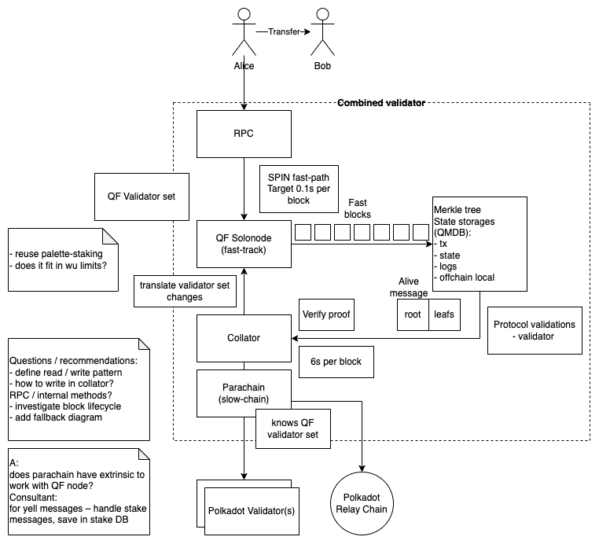
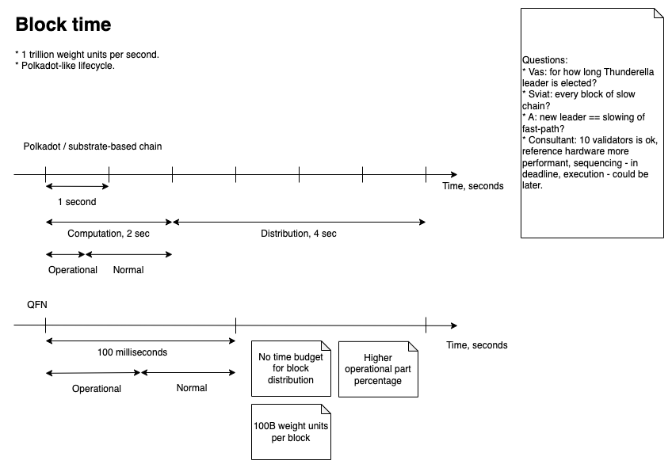
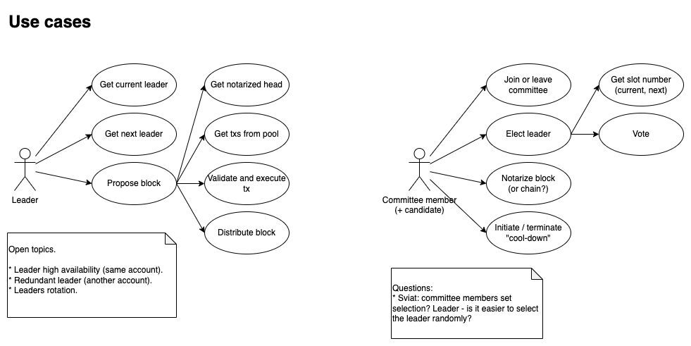
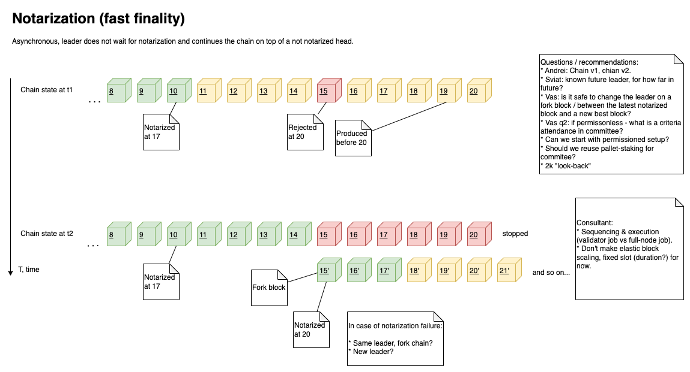

# SPIN

This section includes diagrams illustrating the SPIN mechanism and highlights the questions discussed

## Combined Validator Architecture

Architecture diagram

## Fast path

Block time estimations

Leader and committee member use cases

Notarization (fast finality) fork timeline

